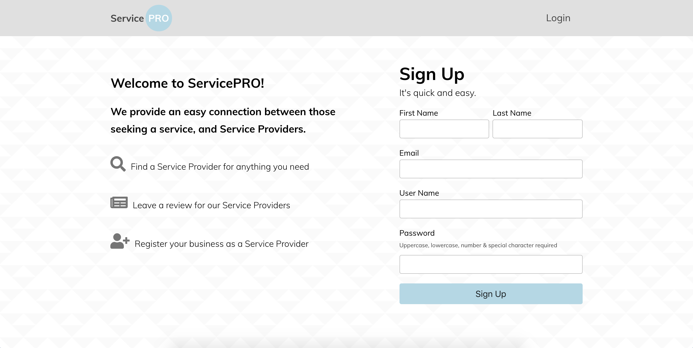

# ServicePRO

## Authors

- Steven Thornton

## Links

- [Live app](https://servicepro-app.now.sh/)
- [Link to server repo](https://github.com/Stevenwthornton0/servicepro_server)

## Demo Account
```
username: dunder
password: password
```

## Screenshots
### Desktop view



 
### Mobile view


## Summary

ServicePRO is a web application that provides a bridge between local businesses and clients. Currently users can search for eight different types of services and can register/edit their own service as well. Users are also able to leave reviews for services and business on their page.

## Technologies
- React
- HTML5
- CSS3
- Jest/Enzyme

